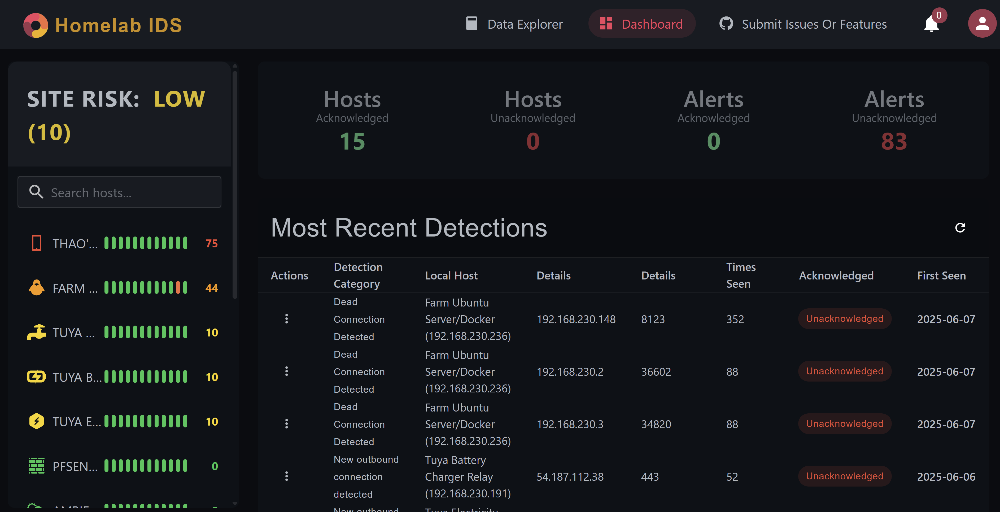
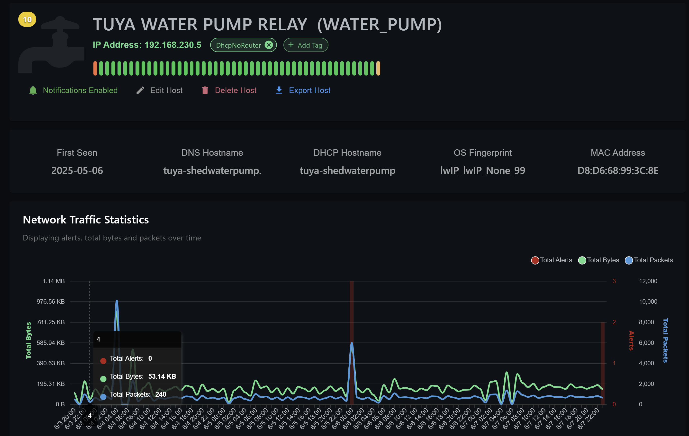
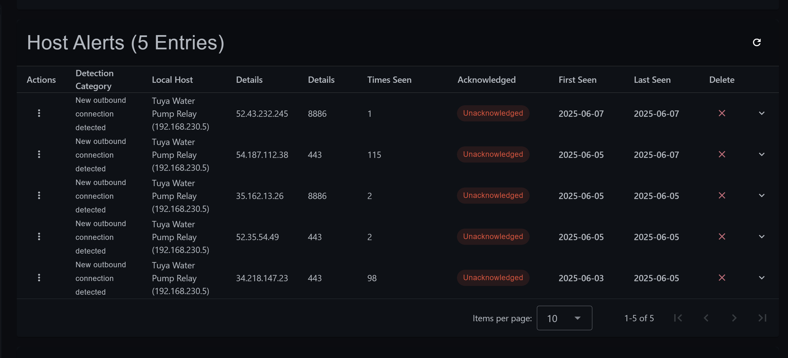
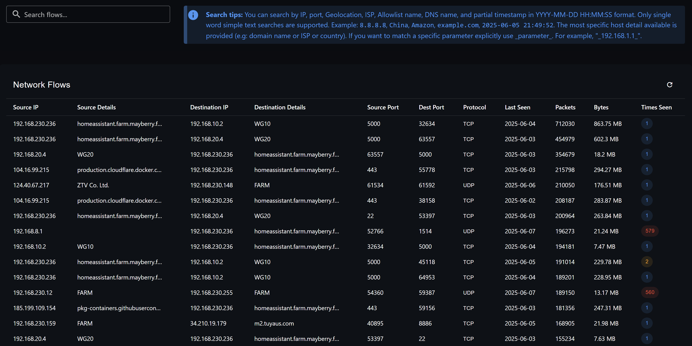
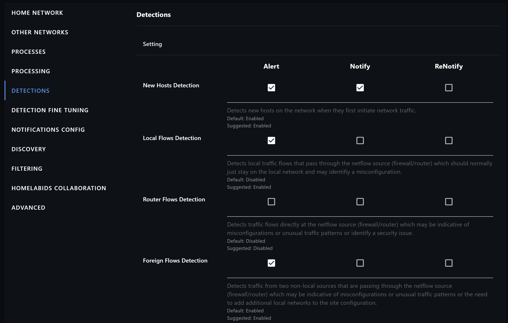

<p align="center">
  
</p>

# Sando - Know your network

Sando is a lightweight network monitoring and security platform for home labs and small networks.
It helps answer:

- What hosts are on my network?
- What internet destinations are they connecting to?
- What DNS lookups are they doing?
- Which flows, hosts, countries, ports, or services deserve attention?

Videos:

- [30 second intro](https://www.youtube.com/watch?v=6P8XtUhSUis)
- [What is Sando?](https://www.youtube.com/watch?v=2rwY5qXNQjk)

---

## What Sando Does

- Builds an inventory of local hosts from NetFlow, DHCP, Pi-hole, reverse DNS, and optional nmap discovery.
- Collects NetFlow v5 records from firewalls and routers such as pfSense and OPNsense.
- Tracks local, router, foreign, new outbound, high-bandwidth, high-risk-port, port-scan, Tor, VPN, reputation-list, and geolocation-related flows.
- Stores flow, host, DNS, alert, reputation, ASN, traffic-stat, and configuration data in SQLite databases under `/database`.
- Sends optional notifications to Telegram and Discord.
- Integrates with Pi-hole, AdGuard Home, Home Assistant, Homepage.dev, MaxMind, IP2ASN, Tor node lists, and reputation feeds.
- Provides optional DHCP server, passive DHCP monitoring, rogue DHCP detection, and sinkhole DNS features.
- Exposes a Vue dashboard and a local API for exploring hosts, alerts, traffic, and settings.

---

## Recent Updates

Recent backend and dashboard updates include:

- Discord notifications: Sando can now send alerts through Discord webhooks in addition to Telegram. See [sando#11](https://github.com/mayberryjp/sando/issues/11) and [sando-website#1](https://github.com/mayberryjp/sando-website/issues/1).
- Safer configuration UI: sensitive settings are obscured by default in the dashboard and can be temporarily revealed with a show/hide control. This covers Telegram, Discord, Pi-hole, AdGuard, and MaxMind secrets. See [sando-website#5](https://github.com/mayberryjp/sando-website/issues/5).
- Firewall interface metadata: host/network data can store firewall interface names when that information is available. See [sando#32](https://github.com/mayberryjp/sando/issues/32).
- Performance database maintenance: `dbperformance` records older than 180 days are removed at backend startup. See [sando#31](https://github.com/mayberryjp/sando/issues/31).
- Troubleshooting note: if the Sando host/container itself is not appearing in traffic or alerts, make sure the server network is included in `LocalNetworks`. See [sando#7](https://github.com/mayberryjp/sando/issues/7).

---

## Architecture

Sando is split into two containers:

- `sando`: Python backend. Runs the NetFlow collector, API, detections, integrations, discovery, watchdog, optional DHCP server, optional sinkhole DNS server, and MCP server.
- `sando-website`: Vue 3/Vite frontend. Serves the dashboard on port `3030` and calls the backend API.

Data flow:

```text
Firewall/router NetFlow v5 -> UDP/2055 -> sando collector
                                      -> SQLite databases in /database
                                      -> API on TCP/8044
                                      -> dashboard on TCP/3030
```

The backend is managed with supervisord and starts multiple processes. Most detections and optional services are controlled by settings and can be enabled or disabled from the dashboard.

---

## Ports

| Service | Port | Required | Notes |
| --- | --- | --- | --- |
| Dashboard | TCP/3030 | Yes | Served by `sando-website` |
| Local API | TCP/8044 | Yes | Served by `sando` |
| NetFlow v5 collector | UDP/2055 | Yes | Configure your firewall/router to export here |
| Sinkhole DNS | TCP/UDP 53 | Optional | Only if `SinkHoleDns` is enabled |
| DHCP server | UDP/67 | Optional | Only if `DhcpServer` is enabled |
| MCP server | TCP/8030 | Optional/experimental | Local MCP endpoint |

Do not expose these ports directly to the internet.

---

## Security

Sando is currently intended for trusted private networks. Not all production security controls are implemented yet, including user authentication, API keys, TLS between the dashboard and API, and database encryption.

Recommended security posture:

- Run Sando only on a private LAN or management VLAN.
- Do not expose `3030`, `8044`, `8030`, `2055`, `53`, or `67` to the internet.
- Use firewall rules to limit dashboard and API access to admin devices.
- Back up the `/database` volume because it contains Sando's persistent state.
- Review opt-in cloud/API settings before enabling them.
- The dashboard masks sensitive configuration values by default, including Telegram, Discord, Pi-hole, AdGuard, and MaxMind secrets.

---

## Installation

See `docker_config_examples/` for backend examples and `sando-website/docker_example_configs/` in the website repository for dashboard examples.

### Backend collector/API container

```yaml
version: "3"
services:
  sando:
    network_mode: host
    container_name: sando
    restart: "unless-stopped"
    image: mayberry4477/sando:latest
    volumes:
      - /docker/sando:/database
    environment:
      - SITE=FARM
      - TZ=Asia/Tokyo
```

`SITE` is the site name shown in Sando. `/database` is the persistent volume for configuration and all SQLite databases.

### Dashboard container

```yaml
version: "3"
services:
  sando-website:
    network_mode: host
    container_name: sando-website
    restart: "unless-stopped"
    image: mayberry4477/sando-website:latest
    volumes:
      - /docker/sando-website:/database
    environment:
      - TZ=Asia/Tokyo
      - SANDO_API_BASE_URL=http://192.168.1.10:8044
```

`SANDO_API_BASE_URL` must be a URL that your browser can reach from your desktop, laptop, or mobile device. Use the IP address or hostname of the machine running the `sando` backend container.

After both containers are running, open:

```text
http://YOUR_SANDO_HOST:3030
```

### Published images vs local builds

Use the `mayberry4477/sando:latest` and `mayberry4477/sando-website:latest` images if you want to pull published containers.

If you build locally from the Dockerfiles, tag the images as `sando:latest` and `sando-website:latest`, or update your compose files to match the local tags you choose.

---

## Initial Configuration

After first startup, configure your router/firewall to export NetFlow v5 to the backend container on UDP port `2055`.

Then open the Sando dashboard and configure:

- Local networks, for example `192.168.1.0/24`.
- Router IP addresses, if you want router-flow detection.
- Processes and detections you want enabled.
- Notification integrations, if desired.
- Optional discovery, Pi-hole, AdGuard, DHCP, sinkhole DNS, reputation, ASN, Tor, or MaxMind integrations.

New host detection is enabled by default in the install configuration and is a good first detection to use while building a local inventory. Other detections can be enabled after you have tuned local networks, approved services, and ignore lists.

If you use Sando's DHCP server, it can work with DHCP relay across multiple VLANs or within one network. All relevant subnets must be configured as local networks.

---

## Configure NetFlow v5 on pfSense

Configuring NetFlow on pfSense is usually a two-step process.

First, install the `softflowd` package from:

```text
System -> Package Manager -> Available Packages
```

Search for `softflowd` and install it.

Second, go to:

```text
Services -> softflowd
```

Recommended settings:

- Enable softflowd: enabled
- Interface: LAN, plus any other interfaces you want to monitor
- Host: IP address of the machine running the `sando` backend container
- Port: `2055`
- Sample: `0`
- Max Flow: `8192`
- Hop Limit: unset
- NetFlow version: `5`
- Bidirectional Flow: unchecked
- Flow Tracking Level: full
- Flow Timestamp Precision: seconds
- Timeout General: `60`
- Other timeout settings: `60`
- MaxTimeout: `300`

Save the settings and confirm Sando starts receiving flows.

---

## Troubleshooting

Useful checks:

- Dashboard: `http://YOUR_SANDO_HOST:3030`
- API health: `http://YOUR_SANDO_HOST:8044/api/online/consolidated`
- Explore database health: `http://YOUR_SANDO_HOST:8044/api/online/explore`
- Confirm your firewall/router exports NetFlow v5 to `UDP/2055`.
- Confirm `SANDO_API_BASE_URL` points to a URL reachable from your browser.
- Check backend and dashboard container logs.
- Check for port conflicts before enabling sinkhole DNS on port `53` or DHCP on port `67`.
- If the Sando host/container itself is not showing traffic, confirm the server network is included in `LocalNetworks`.

Common symptoms:

- Dashboard loads but no data appears: check `SANDO_API_BASE_URL`, API health, and browser console errors.
- API is online but no flows appear: check NetFlow export target IP/port and firewall rules.
- DNS sinkhole will not start: another DNS service may already be bound to port `53`.
- DHCP server will not work: another DHCP service may already own port `67`, or relay/local network settings may be incomplete.

Issues and feature requests can be submitted on GitHub.

---

## Configuration Reference

Configuration is stored in the `configuration` SQLite table and can be changed from the dashboard. The defaults below are based on the backend install configuration.

### Detection settings

| Key | Default | Description |
| --- | --- | --- |
| `NewHostsDetection` | `1` | Detect new hosts on the network. |
| `LocalFlowsDetection` | `0` | Detect local network flows. |
| `RouterFlowsDetection` | `0` | Detect flows involving configured router IPs. |
| `ForeignFlowsDetection` | `0` | Detect non-local or foreign flows. |
| `NewOutboundDetection` | `0` | Detect new outbound connections. |
| `GeolocationFlowsDetection` | `0` | Detect flows involving banned countries. |
| `BypassLocalDnsDetection` | `0` | Detect clients bypassing approved local DNS servers. |
| `IncorrectAuthoritativeDnsDetection` | `0` | Detect incorrect authoritative DNS behavior. |
| `BypassLocalNtpDetection` | `0` | Detect clients bypassing approved local NTP servers. |
| `IncorrectNtpStratrumDetection` | `0` | Detect incorrect NTP stratum behavior. |
| `DeadConnectionDetection` | `0` | Detect dead or stale connections. |
| `ReputationListDetection` | `0` | Detect traffic to reputation-list networks. |
| `VpnTrafficDetection` | `0` | Detect VPN traffic. |
| `HighRiskPortDetection` | `0` | Detect traffic involving high-risk ports. |
| `ManyDestinationsDetection` | `0` | Detect sources talking to many destinations. |
| `PortScanDetection` | `0` | Detect port scanning behavior. |
| `TorFlowDetection` | `0` | Detect traffic to known Tor nodes. |
| `HighBandwidthFlowDetection` | `0` | Detect high-packet or high-byte flows. |
| `RogueDhcpDetection` | `0` | Detect DHCP servers not in the approved list. |
| `AlertOnCustomTags` | `0` | Alert on flows matching configured custom tags. |

Note: the current backend configuration key is spelled `IncorrectNtpStratrumDetection`.

### Network and flow settings

| Key | Default | Description |
| --- | --- | --- |
| `LocalNetworks` | `[]` | Local network CIDRs. |
| `StartCollector` | `1` | Start the NetFlow collector. |
| `ScheduleProcessor` | `1` | Enable scheduled flow processing. |
| `ProcessRunInterval` | `60` | Detection processor interval in seconds. |
| `CollectorProcessingInterval` | `60` | Collector processing interval in seconds. |
| `ProcessingInterval` | `60` | General processing interval. |
| `CleanNewFlows` | `1` | Clean transient new-flow records after processing. |
| `RemoveBroadcastFlows` | `1` | Remove broadcast flows from processing. |
| `RemoveMulticastFlows` | `1` | Remove multicast flows from processing. |
| `RemoveLinkLocalFlows` | `1` | Remove link-local flows from processing. |
| `DnsResolverTimeout` | `3` | DNS resolver timeout. |
| `DnsResolverRetries` | `1` | DNS resolver retry count. |
| `MaxUniqueDestinations` | `30` | Threshold for many-destination detection. |
| `MaxPortsPerDestination` | `15` | Threshold for port-scan detection. |
| `HighRiskPorts` | `135,137,138,139,445,25,587,22,23,3389` | Ports treated as high risk. |
| `BandwidthAnomalyMuliplierThreshold` | `10` | Bandwidth anomaly multiplier threshold. |
| `MaxPackets` | `30000` | Packet threshold for high-bandwidth detection. |
| `MaxBytes` | `30000000` | Byte threshold for high-bandwidth detection. |
| `TrafficStatsPurgeIntervalDays` | `31` | Age in days before traffic stats are purged. |

The backend also removes `dbperformance` records older than 180 days at startup.

### Approved lists and tuning

| Key | Default | Description |
| --- | --- | --- |
| `ApprovedLocalNtpServersList` | empty | Approved local NTP servers. |
| `ApprovedLocalDnsServersList` | empty | Approved local DNS servers. |
| `ApprovedAuthoritativeDnsServersList` | empty | Approved authoritative DNS servers. |
| `ApprovedNtpStratumServersList` | empty | Approved NTP stratum servers. |
| `ApprovedVpnServersList` | empty | Approved VPN servers. |
| `ApprovedHighRiskDestinations` | empty | Destinations allowed for high-risk-port flows. |
| `ApprovedDhcpServersList` | empty | Approved DHCP servers for rogue DHCP detection. |
| `IgnoreListEntries` | `[]` | Ignore-list entries. |
| `TagEntries` | `[]` | Custom tag entries. |
| `AlertOnCustomTagList` | empty | Custom tags that should generate alerts. |

### Geolocation, reputation, ASN, and Tor

| Key | Default | Description |
| --- | --- | --- |
| `BannedCountryList` | `North Korea,Iran,Russia,Ukraine,Georgia,Armenia,Azerbaijan,Belarus,Syria,Venezuela,Cuba,Myanmar,Afghanistan` | Countries used by geolocation flow detection. |
| `MaxMindAPIKey` | empty | MaxMind API key, if used for geolocation data. |
| `ReputationUrl` | `https://iplists.firehol.org/files/firehol_level1.netset` | Reputation list URL. |
| `ReputationListRemove` | `192.168.0.0/16,0.0.0.0/8,224.0.0.0/3,169.254.0.0/16` | Networks removed from imported reputation lists. |
| `TorNodesUrl` | `https://www.dan.me.uk/torlist/?full` | Tor node list URL. |
| `ImportAsnDatabase` | `1` | Import IP-to-ASN data. |
| `ImportServicesList` | `1` | Import network service/port metadata. |
| `IntegrationFetchInterval` | `86400` | Integration fetch interval in seconds. |

### Discovery and DNS history

| Key | Default | Description |
| --- | --- | --- |
| `DiscoveryReverseDns` | `0` | Enable reverse DNS discovery. |
| `DiscoveryPiholeDhcp` | `0` | Import DHCP leases from Pi-hole. |
| `EnableLocalDiscoveryProcess` | `0` | Enable local discovery process. |
| `DiscoveryProcessRunInterval` | `28800` | Discovery run interval in seconds. |
| `DiscoveryNmapOsFingerprint` | `0` | Enable nmap OS fingerprinting. |
| `StorePiHoleDnsQueryHistory` | `0` | Store Pi-hole DNS query history. |
| `PiholeUrl` | empty | Pi-hole API URL. |
| `PiholeApiKey` | empty | Pi-hole API key. |
| `PiHoleDnsFetchRecordSize` | `10000` | Number of Pi-hole DNS records to fetch. |
| `PiHoleDnsFetchInterval` | `3600` | Pi-hole DNS fetch interval in seconds. |
| `StoreAdGuardDnsQueryHistory` | `0` | Store AdGuard Home DNS query history. |
| `AdGuardUrl` | empty | AdGuard Home URL. |
| `AdGuardUsername` | empty | AdGuard Home username. |
| `AdGuardPassword` | empty | AdGuard Home password. |
| `DnsResponseLookupResolver` | empty | Resolver used to fill missing DNS response data. |
| `PerformDnsResponseLookupsForInvestigations` | `0` | Enable DNS response lookups for investigations. |

Some AdGuard keys may be created by the UI or integrations rather than seeded in the initial install configuration.

### Notifications

| Key | Default | Description |
| --- | --- | --- |
| `TelegramEnabled` | `0` | Enable Telegram notifications. |
| `TelegramBotToken` | empty | Telegram bot token. |
| `TelegramChatId` | empty | Telegram chat ID. |
| `DiscordEnabled` | `0` | Enable Discord webhook notifications. |
| `DiscordWebhookUrl` | empty | Discord webhook URL. |

Sensitive notification values are obscured by default in the dashboard configuration UI.

### Optional services

| Key | Default | Description |
| --- | --- | --- |
| `SinkHoleDns` | `0` | Enable sinkhole DNS server on port `53`. |
| `DhcpServer` | `0` | Enable Sando DHCP server on port `67`. |
| `DhcpPassiveMonitoring` | `0` | Enable passive DHCP monitoring. |

The sinkhole DNS server responds with `NXDOMAIN` and records queries. This can help profile or block selected IoT behavior, but it conflicts with other DNS services on port `53`.

### Cloud/API opt-in settings

| Key | Default | Description |
| --- | --- | --- |
| `SendConfigurationToCloudApi` | `0` | Send instance configuration to the Sando cloud API. |
| `SendErrorsToCloudApi` | `0` | Send error reports to the Sando cloud API. |
| `SendDeviceClassificationsToHomelabApi` | `0` | Upload device classifications. |

These settings are disabled by default. Review what each option sends before enabling it.

### System metadata

| Key | Default | Description |
| --- | --- | --- |
| `DatabaseSchemaVersion` | current backend schema version | Stored database schema version. |

---

## Screenshots

### Dashboard



### Host View



### Alerts



### Flow Explorer



### Settings Page



---

## Contributing

Contributions are welcome. Bug fixes, feature work, documentation improvements, and integration examples are all useful.

---

## License

Sando is licensed under the GNU Affero General Public License v3 (AGPLv3). See `LICENSE` for details.

---

## Community

- Reddit: [r/SandoSecurityAndDhcp](https://www.reddit.com/r/SandoSecurityAndDhcp/)
- YouTube: [@SandoSecurityAndDhcp](https://www.youtube.com/@SandoSecurityAndDhcp)
- GitHub: [mayberryjp/sando](https://github.com/mayberryjp/sando)

If Sando is useful, consider starring the project on GitHub.
